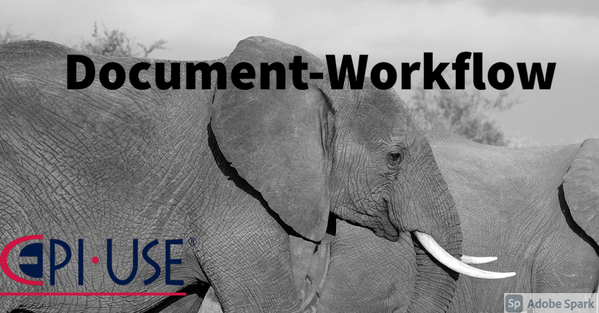

# Document WorkFlow

 
 

 
 
 
 
 

## Project Description 
### Due to the COVID-19 pandemic, many companies have been forced to move their op-erations onto online platforms. In light of this, it is more important than ever for companies to have access to web-based solutions that facilitate the reviewing, approval and signing of documents to facilitate the workflow process. While some document signing solutions such as DocuSign and HelloSign exist, Document Workflow aims to provide further functionality that these solutions are missing in conjunction to being free for any and all prospective clients to use. 
### The overall goal would be to provide EPI-USE and their clients with an easy and convenient way to review, approve and sign important documents.This solution should provide a web-based and mobile platform where one can securelyupload documents for digital signing, determine approval workflows, and track the approval status of in-progress workflows. Simple approval should allow users to action adocument at the click of a button by making use of fingerprint authentication on theirmobile devices. The document setup process should be facilitated by image processingcombined with a trained machine learning model to identify and suggest areas whereinformation is required by approvers, such as names, dates, signatures, and initials.

## Code Quality
<!--  -->

# Team Jar-gon
## Team Members

**Team Members**                                                                |                                                                                  **Profiles**                                                                                  |                                     **Profile Description**                                     |
| :-------------------------------------------------------------------------------------------------------------------------------------------: | :----------------------------------------------------------------------------------------------------------------------------------------------------------------------------: | :-----------------------------------------------------------------------------------------: |
|  Delaray Botha   u14011639 |       [GitHub](https://github.com/delareytuks)   [Profile Page](https://delareytuks.github.io)   [LinkedIn](https://www.linkedin.com/in/delarey-botha-82886820b/)   | Full-time Backend debugger, part-time regretter of early design decisions |
|   Brenton Stroberg   u17015741 | [GitHub](https://github.com/u17015741)   [Profile Page](https://u17015741.github.io)   [LinkedIn](https://www.linkedin.com/in/brenton-stroberg-a15219172/)   | Web developer, who enjoys the challenges of developing new software. Has more dogs than he has bugs in his code. |
|  Timothy Hill   u17326622   | [GitHub]([https://github.com/u17112592])   [Profile Page](https://u17112592.github.io/)   [LinkedIn](https://www.linkedin.com/in/timothy-hill-759a0b20b/)   | Backend developer. Interested in theoretical computer sciences and math. Loves cats and endurance sports |

# GitHub-Management

## Monorepo and Git Flow

### Branching Strategy

* master
    * develop
        * develop_backend
            * develop_backend_subsystem
        * develop_frontend
            * develop_frontend_subsystem  
         
# Documentation
## Software Requirements Specification
### Software Requirement Specifications:
[v1 and v2](https://www.overleaf.com/read/wdkdstnqdrbq)
[v3](https://www.overleaf.com/read/ssnwjnpqqxjm)
### Architectural Requirements Document:
[v1 and v2](https://www.overleaf.com/read/ysxrgzkpvwwy)
[v3](https://www.overleaf.com/read/vkrwvnpydfhb)
### Installation Guide:
[v1](https://www.overleaf.com/read/xqggmbwpgxjq)
### User Manual verion:
[v1](https://www.overleaf.com/read/zmcjkphgdhrv)
### Coding Standards version:
[v1](https://www.overleaf.com/read/pqpbcypgydjh)
<!--- ### Previous Versions --->

## Technology Frameworks
### Client Side: Ionic and Angular
### Server Side: NodeJS Express
### Persistence: Mongoose
### Database: MongoDB 

## Testing 
### Jest
### Cypress
### Karma

# Demo-Video-Links

* <a href="https://www.youtube.com/watch?v=bo8cdDzqsPg&feature=youtu.be"> Demo 1 </a>
* <a href="https://youtu.be/DXzyT5xn2RM"> Demo 2 </a>
* <a href="https://youtu.be/KkhxXOuitl0"> Demo 3 </a>
* <a href=""> Demo 4 - Coming Soon! </a>

---

# Project Management Tools

- :open_book: [Document WorkFlow Project board](https://github.com/COS301-SE-2021/Document-Workflow/projects/1)
- 📖 [Document Workflow Sprint Planning](https://tuks306306.monday.com/boards/1428586018/views/29350913)
